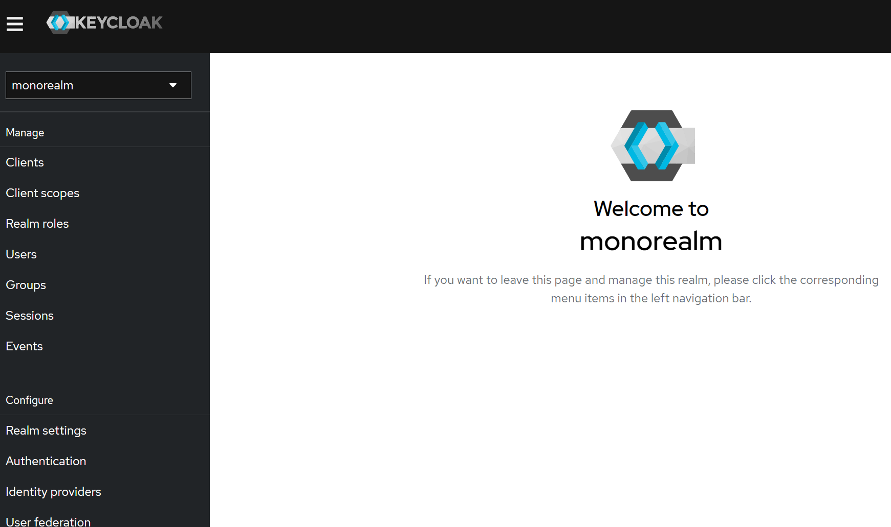
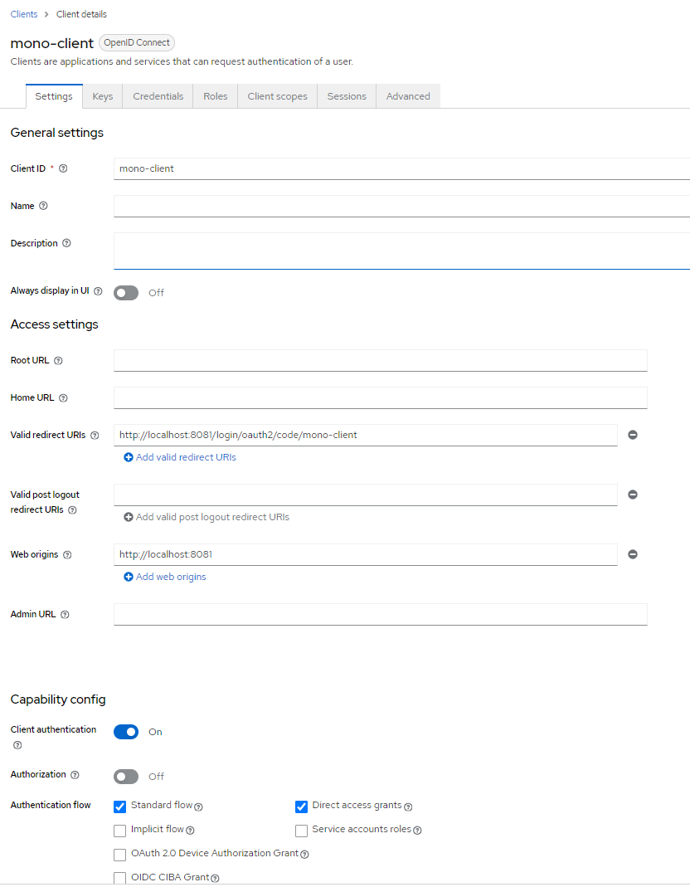
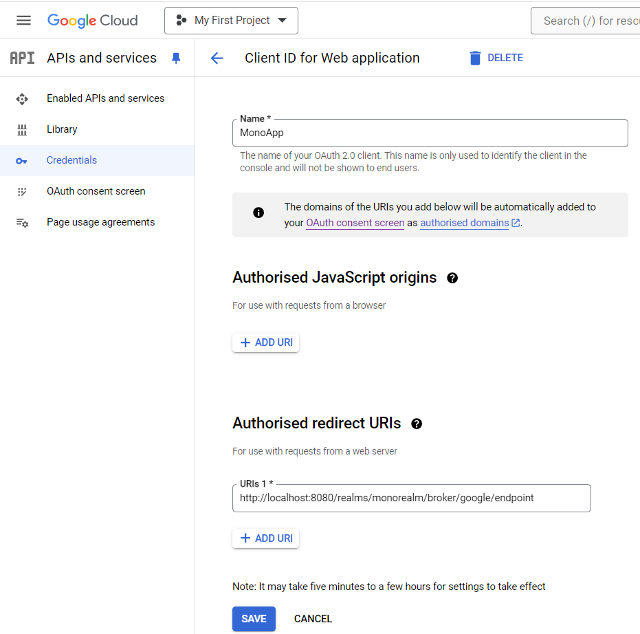
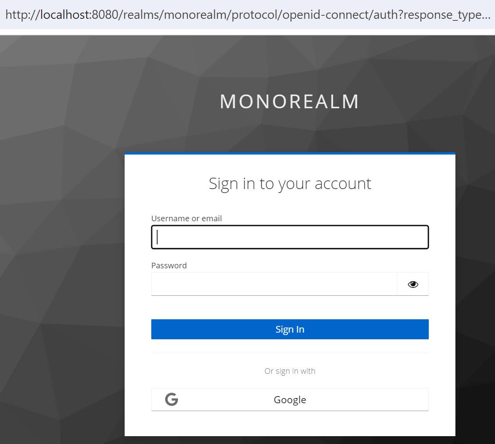
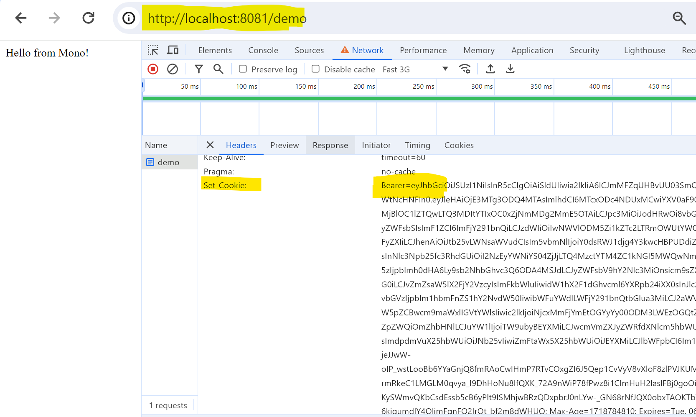

# SSO using Keycloak and Spring Boot

I will use Google to perform SSO and redirect to keycloak for authentication. I will use Keycloak auth token for authentication and authorization in my spring boot microservice.

### Create a new realm in Keycloak
Login with admin and create new realm.

### Create a new client in Keycloak
1. Provide client id, name etc.
2. Set Client authentication on.
3. Provide Valid redirect URI http://localhost:8081/login/oauth2/code/mono-client

4. Copy client id and secret and update in application.properties.

### Create new Role
1. Go to the Realm Roles and crate a new role as admin.

### Create a new OAuth 2.0 Client ID in Google Cloud Console
1. Check below screenshot and create a new client.
2. Copy client id and secret.
   

### Identity Provider Settings
1. Set the identity provider as Google.
2. Put the copied id and secret in previous step.
3. Go to Mapper and create a new mapper.
4. Select Mapper type as Hardcoded role.
5. Map the role "admin".

### Run the application
Access http://localhost:8081/demo
You will be redirected to Keycloak login page.
Choose Google and login with your google account.

### Access the application
You will be redirected to your application and you can see keycloak token in cookie. 

